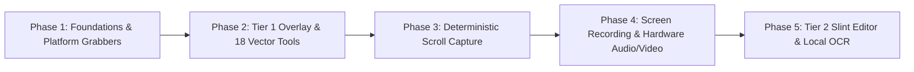

# Camerashot: Master Implementation Plan

High-performance, local-first screenshot, screen recording, scroll capture, and vector annotation suite written in **Rust** targeting **macOS (13+)** and **Linux (Wayland: GNOME, KDE, Hyprland & X11)**.

- **Contract Reference:** [camerashot_brainstorm_contract.md](file:///Users/vchun/.gemini/antigravity-cli/brain/27de98ba-0c2a-4d78-9c4b-ca278d0358d8/camerashot_brainstorm_contract.md)
- **Scout Report:** [camerashot_scout_report.md](file:///Users/vchun/.gemini/antigravity-cli/brain/27de98ba-0c2a-4d78-9c4b-ca278d0358d8/camerashot_scout_report.md)
- **Reference Codebase:** [macshot](file:///Users/vchun/Codes/My-projects/02-Ariadnev-Eco/06-Camerashot/ref-souce-code-macshot/macshot) (Swift 5 / AppKit)

---

## Phased Roadmap Overview

### Phase Summary

| Phase | Description | Key Deliverables | Status |
| :--- | :--- | :--- | :---: |
| [**Phase 1**](file:///Users/vchun/Codes/My-projects/02-Ariadnev-Eco/06-Camerashot/plans/2026-09-18-camerashot-implementation/phase-01-foundations-and-platform-core.md) | **Foundations & Platform Grabbers** | Cargo workspace setup, `camerashot-core` data models, `BoundarySnapIndex` edge detector, macOS SCK grabber, Linux MIT-SHM & PipeWire grabbers. | **Completed** |
| [**Phase 2**](file:///Users/vchun/Codes/My-projects/02-Ariadnev-Eco/06-Camerashot/plans/2026-09-18-camerashot-implementation/phase-02-tier1-overlay-and-vector-tools.md) | **Tier 1 Fast Overlay & 18 Vector Tools** | Instant <15ms overlay (`wlr-layer-shell`, `NSPanel` Level 257), `tiny-skia` 2D canvas, Chaikin smoothing ($N=8$, 2 passes), 18 tools, Beautify chrome. | **Completed** |
| [**Phase 3**](file:///Users/vchun/Codes/My-projects/02-Ariadnev-Eco/06-Camerashot/plans/2026-09-18-camerashot-implementation/phase-03-scroll-capture-engine.md) | **Deterministic Scroll Capture Engine** | Synthetic scroll (`libei`/`XTest`/`CGEvent`), `xxHash64` settlement check, 2D FFT Phase Correlation displacement, SAD margin/header filtering, -1px seam bias. | **Completed** |
| [**Phase 4**](file:///Users/vchun/Codes/My-projects/02-Ariadnev-Eco/06-Camerashot/plans/2026-09-18-camerashot-implementation/phase-04-screen-recording-and-audio.md) | **Screen Recording & Audio Engine** | Up to 120 FPS video streaming, PipeWire/CoreAudio loopback + mic capture, VA-API/NVENC/VideoToolbox hardware encoding, native Rust `gifski` export. | **Completed** |
| [**Phase 5**](file:///Users/vchun/Codes/My-projects/02-Ariadnev-Eco/06-Camerashot/plans/2026-09-18-camerashot-implementation/phase-05-tier2-editor-and-ocr.md) | **Tier 2 Slint Editor & Local OCR** | Slint standalone canvas editor, multi-track video timeline (Trim, Zoom punch with smoothstep, Censor blur, Speed ramps), embedded ONNX RapidOCR + Apple Vision, 11 PII regexes with atomic undo. | **In Progress** |

---

## Architectural Invariants & Rules

1. **Wayland Snapping Rule:** All snapping on Wayland must execute via `BoundarySnapIndex` ($\Delta C = \sqrt{\Delta R^2 + \Delta G^2 + \Delta B^2} \ge 28$, span support $\ge 55\%$) on the captured frame. Zero compositor window query assumptions.
2. **The `captureDrawRect` Rule:** Coordinate transforms, crop bounds, convolution filters (blur/pixelate), and OCR bounding boxes must strictly anchor to `captureDrawRect` (`screenBounds` in overlay mode, `selectionRect` in editor mode). Never use raw outer window bounds.
3. **Chaikin Smoothing Pipeline:** Mouse drag captures raw points. On release: endpoint padding with $N-1$ duplicates ($N=8$), trailing moving average, 2 passes of Chaikin subdivision ($Q_i = 0.75P_i + 0.25P_{i+1}, R_i = 0.25P_i + 0.75P_{i+1}$), and linear pressure interpolation.
4. **Scroll Seam Bias:** Stitched strips must be appended using $\text{safeOffset} = \max(1, \Delta y - 1)$ to enforce a 1-pixel overlap, eliminating horizontal subpixel interpolation tears.
5. **Decoupled Two-Tier Windowing:** Tier 1 overlay (`camerashot-overlay`) uses a lightweight `tiny-skia` surface on native protocols (<15ms presentation); Tier 2 editor (`camerashot-editor`) uses Slint for rich declarative UI and the video timeline.
